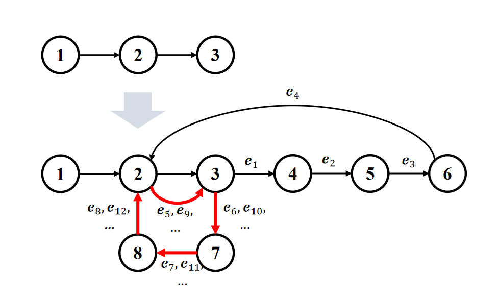

# Momentum Decoding For Neural Text Generation
**Authors**: Tian Lan and Yixuan Su

**[Contact]** If you have any questions, feel free to contact me via (lantiangmftby at gmail.com).

This repository contains code other related resources of our paper ["Momentum Decoding: Open-ended Text Generation As Graph Exploration"](https://arxiv.org/abs/).

****
If you find our paper and resources useful, please kindly leave a star and cite our papers. Thanks!

```bibtex
@article{su2022contrastiveiswhatyouneed,
  title={Contrastive Search Is What You Need For Neural Text Generation},
  author={Yixuan Su and Nigel Collier},
  journal={arXiv preprint arXiv:2210.14140},
  year={2022}
}
```

****

<span id='all_catelogue'/>

### Catalogue:
* <a href='#introduction'>1. Introduction</a>
* <a href='#inference on benchmarks'>2. Inference on benchmarks</a>
* <a href='#LMs_isotropy'>3. Measuring Isotropy of LMs</a>
* <a href='#open_ended_text_generation'>4. Open-ended Text Generation</a>
* <a href='#code_generation'>5. Code Generation</a>
* <a href='#machine_translation'>6. Machine Translation</a>
    
****

<span id='introduction'/>

#### 1. Introduction: <a href='#all_catelogue'>[Back to Top]</a>

Open-ended text generation with autoregressive language models (LMs) is an indispensable component in various NLP applications. Typical examples include dialogue systems , contextual text completion, story generation, etc.

Conventional maximization-based methods for this task, such as greedy search and beam search, often lead to the degeneration problem, i.e. the generated text is unnatural and contains undesirable repetitions.
Existing solutions for this problem can be divided into two categories: 
(1) Stochastic methods, e.g. top-$k$ and nucleus sampling, introduce randomness to avoid undesirable repetitions. However, the intrinsic stochasticity of these sampling approaches often leads to semantic incoherence and topic drift in the generated text.
(2) Deteriminstic method, i.e. contrastive search, relies on a one-step look-ahead mechanism to encourage diverse generations. While obtaining superior performances, such look-ahead operation demands extra computational overhead.

In this study, we perceive open-ended text generation from a new perspective. Specifically, we view it as an exploration process within a directed graph.
Therefore, it allows us to formulate the phenomenon of degeneration as circular loops within the directed graph. In the following figure, we provide an illustration in which the LM generates text given a prefix of three tokens, i.e. [1,2,3], and gets stuck in the circular loops, i.e. repetitions, of [2,3,7,8]. Intuitively, such degeneration can be addressed if the tendency of the LM to stay in the circular loop can be _properly_ discouraged, therefore allowing the LM to jump out of the loop at the correct position and produce text with _natural_ repetitions. Based on this motivation, we propose a novel decoding method---_momentum decoding_---which encourages the LM to greedily explore new nodes outside the current graph. Meanwhile, it also allows the LM to return to the existing nodes but with a momentum downgraded by a pre-defined resistance function. 



Three benchmarks are used in this paper, which are listed under `data` folder (`wikitext`, `wikinews`, `story`).

****


<span id='inference on benchmarks'/>

##### 1. prepare the environment

```bash
pip install -r requirments.txt
```

##### 2. get into the folder

```bash
cd open_ended_generation/english
```

##### 3. running baselines

The following examples runs on `wikinews` benchmark, replace it with `wikitext` or `story` to test other benchmark

1. run the greedy search

    ```bash
    CUDA_VISIBLE_DEVICES=0 python ../inference.py\
    --model_name gpt2-xl\
    --data_path ../../../data/wikinews/wikinews.jsonl\
    --data_name wikinews\
    --decoding_method greedy\
    --prefix_len 40\
    --decoding_len 200\
    --save_path_prefix ../inference_results/
    ```

2. run the beam search
    ```bash
    CUDA_VISIBLE_DEVICES=1 python ../inference.py\
    --model_name gpt2-xl\
    --data_path ../../../data/wikinews/wikinews.jsonl\
    --data_name wikinews\
    --decoding_method beam\
    --prefix_len 40\
    --decoding_len 200\
    --save_path_prefix ../inference_results/
    ```
  
3. run the nucleus sampling

    ```bash
    CUDA_VISIBLE_DEVICES=2 python ../inference.py\
    --model_name gpt2-xl\
    --data_path ../../../data/wikitext/wikitext.jsonl\
    --data_name wikitext\
    --decoding_method nucleus\
    --number_of_instance_to_generate_per_method 3\
    --prefix_len 40\
    --decoding_len 200\
    --save_path_prefix ../inference_results/
    ```
   
4. run the top-$k$ sampling

    ```bash
    CUDA_VISIBLE_DEVICES=3 python ../inference.py\
    --model_name gpt2-xl\
    --data_path ../../../data/wikitext/wikitext.jsonl\
    --data_name wikitext\
    --decoding_method topk\
    --number_of_instance_to_generate_per_method 3\
    --prefix_len 40\
    --decoding_len 200\
    --save_path_prefix ../inference_results/
    ```
    
5. run the contrastive search

    ```bash
    CUDA_VISIBLE_DEVICES=6 python ../inference.py\
    --model_name gpt2-xl\
    --data_path ../../../data/wikitext/wikitext.jsonl\
    --data_name wikitext\
    --decoding_method contrastive\
    --prefix_len 40\
    --decoding_len 200\
    --save_path_prefix ../inference_results/
    ```
    
6. run the momentum decoding

    ```bash
    CUDA_VISIBLE_DEVICES=7 python ../inference.py\
    --model_name gpt2-xl\
    --data_path ../../../data/story/story.jsonl\
    --data_name story\
    --decoding_method resistance\
    --prefix_len 40\
    --decoding_len 200\
    --save_path_prefix ../inference_results/
    ```
    
    
##### 4. test the diversity, MAUVE, and gen-length

This example test the results generated by contrastive search
```bash
CUDA_VISIBLE_DEVICES=1 python ../measure_diversity_mauve_gen_length.py\
    --test_path ../inference_results/gpt2-xl/story/contrastive/contrastive_result.json
```


##### 5. test the Coherence
This example test the results generated by momentum decoding
```bash
CUDA_VISIBLE_DEVICES=6 python ../compute_coherence.py\
    --opt_model_name facebook/opt-2.7b\
    --test_path ../inference_results/gpt2-xl/story/resistance/resistance_result.json
```


##### 6. compute the greedy ratio

```bash
CUDA_VISIBLE_DEVICES=6 python ../compute_greedy_ratio.py \
    --data_path ../../../data/wikitext/wikitext.jsonl\
    --model_name gpt2-xl\
    --data_name wikitext\
    --decoding_method greedy
```

****

<span id='LMs_isotropy'/>

##### 3. Measuring Isotropy of LMs: <a href='#all_catelogue'>[Back to Top]</a>

The detailed tutorial on measuring the isotropy of LMs is provided [[here]](./isotropy_analysis/).

**[Note]** To replicate our experimental results, please make sure you have installed the environment as
```yaml
pip install simctg --upgrade
```


****

<span id='open_ended_text_generation'/>

##### 4. Open-ended Text Generation: <a href='#all_catelogue'>[Back to Top]</a>

The detailed tutorial on the experiments of open-ended text generation is provided [[here]](./open_ended_generation/).

**[Note]** To replicate our experimental results, please make sure you have installed the environment as
```yaml
pip install simctg --upgrade
```

****

<span id='code_generation'/>

##### 5. Code Generation: <a href='#all_catelogue'>[Back to Top]</a>

The detailed tutorial on the experiments of code generation is provided [[here]](./code_generation/).

**[Note]** To replicate our experimental results, please make sure you have installed the environment as
```yaml
pip install simctg --upgrade
```

****

<span id='machine_translation'/>

##### 6. Machine Translation: <a href='#all_catelogue'>[Back to Top]</a>

The detailed tutorial on the experiments of machine translation is provided [[here]](./translation/).

**[Note]** To replicate our experimental results, please make sure you have installed the environment as
```yaml
pip install simctg --upgrade
```


